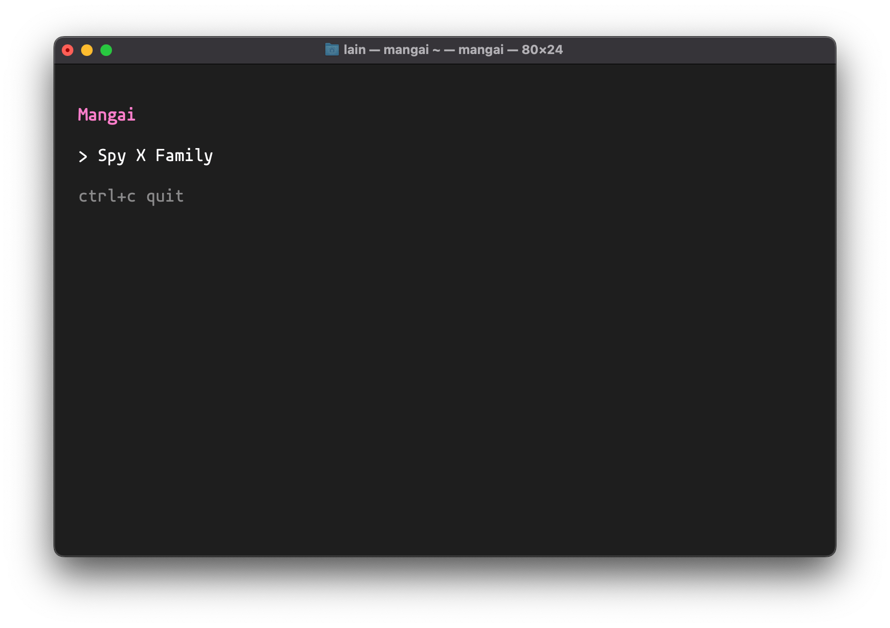
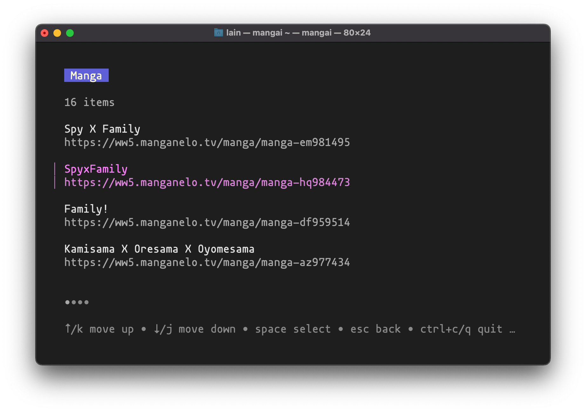
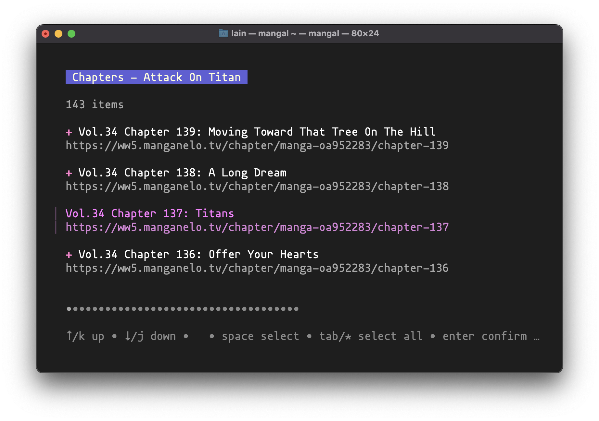
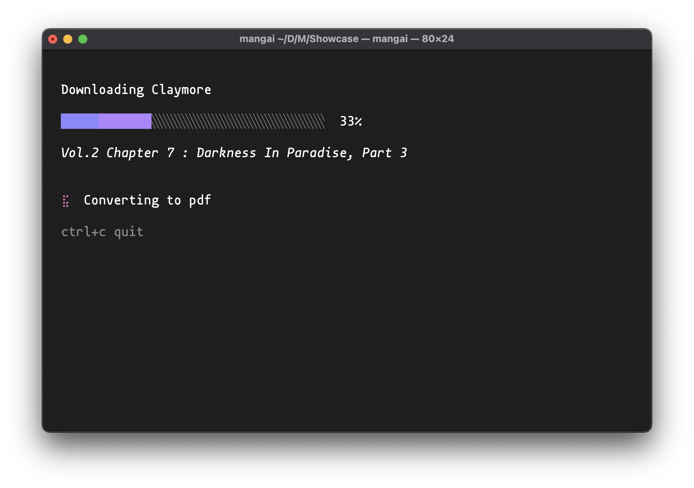

<h1 align="center">Mangai 📖</h1>
<h3 align="center">A Manga Downloader</h3>
<p align="center">
    
</p>

- [About](#about)
- [Screenshots](#screenshots)
- [Examples](#examples)
- [Install / Build](#installation--build)
- [Limitations](#limitations)

## About

✨ __Mangai__ is a fancy TUI app written in go that scrapes, downloads and packs manga into pdfs

⚙️ The most important feature of Mangai is that it supports user defined scrapers
that can be added with just a few lines of config file (see [limitations](#limitations))

🧋 Built with [Bubble Tea framework](https://github.com/charmbracelet/bubbletea)

🍿 This app is inspired by __awesome__ [ani-cli](https://github.com/pystardust/ani-cli). Check it out!

## Screenshots






## Examples

<h3 align="center">Usage example</h4>

[](https://asciinema.org/a/rihXl6l2iBDQe2iteYBqXFyRy)<br><br>
<h3 align="center">Config example</h3>

Config is located at the OS default config directory.

- __Unix__ - `$XDG_CONFIG_HOME/mangai/config.toml` if `$XDG_CONFIG_HOME` exists, else `$HOME/.config/mangai/config.toml`
- __Darwin__ (macOS) - `$HOME/Library/Application\ Support/mangai/config.toml`
- __Windows__ - `%AppData%\mangai\config.toml`
- __Plan 9__ - `$home/lib/mangai/config.toml`

Custom config paths not supported _(yet)_

_By default (if no config defined) Mangai uses [manganelo](https://ww5.manganelo.tv) as a source_

```toml
# Which sources to use. You can use several sources in descendant order priority
use = ['manganelo']

# Default download path
path = '.'

# Fullscreen mode
fullscreen = true

# Download pages asynchronously
# Do not turn it off unless you really need it
# since it will decrease download speed dramatically.
# You could need it if the site you are using
# is blocking you for too many requests
async_download = true


[sources]
    [sources.manganelo]
    # Base url
    base = 'https://ww5.manganelo.tv'

    # Search endpoint. Put %s where the query should be
    search = 'https://ww5.manganelo.tv/search/%s'

    # Selector of entry anchor (<a></a>) on search page
    manga_anchor = '.search-story-item a.item-title'

    # Selector of entry title on search page
    manga_title = '.search-story-item a.item-title'

    # Manga chapters anchors selector
    chapter_anchor = 'li.a-h a.chapter-name'

    # Manga chapters titles selector
    chapter_title = 'li.a-h a.chapter-name'

    # Reader page images selector
    reader_pages = '.container-chapter-reader img'
```

## Installation / Build

Currently, Mangai can be installed only by building it from source.
So you will need [go installed](https://go.dev/doc/install) to proceed further

1. `git clone https://github.com/metafates/Mangai.git`
2. `cd Mangai`
3. `make install` - `make` is used to set version string. If you can't use make (or don't want to?) feel free to just
   run `go install`.

That's it!
If you're not sure where binary is installed run `go list -f '{{.Target}}'` in the project directory

To uninstall run `make uninstall`

## Limitations

Even though most manga sites will work, there exists some limitation to which sites could be added

- Navigation layout should follow this model
    - Each manga have a separate page
    - Manga page should have a some form of chapters list (not lazy loaded)
    - Each chapter should have a separate page with pages (images)
- No anti-bot protection 🤖

<br>

Some sites that work well

- https://manganato.com
- https://ww3.mangakakalot.tv
- https://ww5.manganelo.tv

## TODO

- __Add tests__ ⚠️
- Better error handling
- Surpass some scraping [limitations](#limitations)
- Refactor channels management
- Make prompt look better
- Add Mangai to package managers (homebrew, scoop, apt, ...)
- Extend config (add customization, maybe?)
- Make site for home page (maybe?)

## PS

This is actually my first TUI app _and_ go project, so feel free to point out any issues you find 🙂